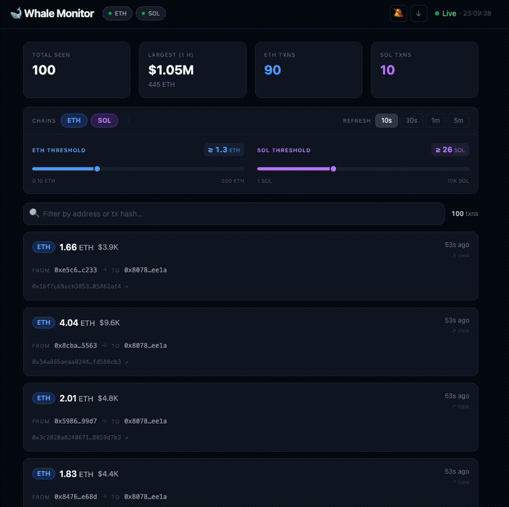
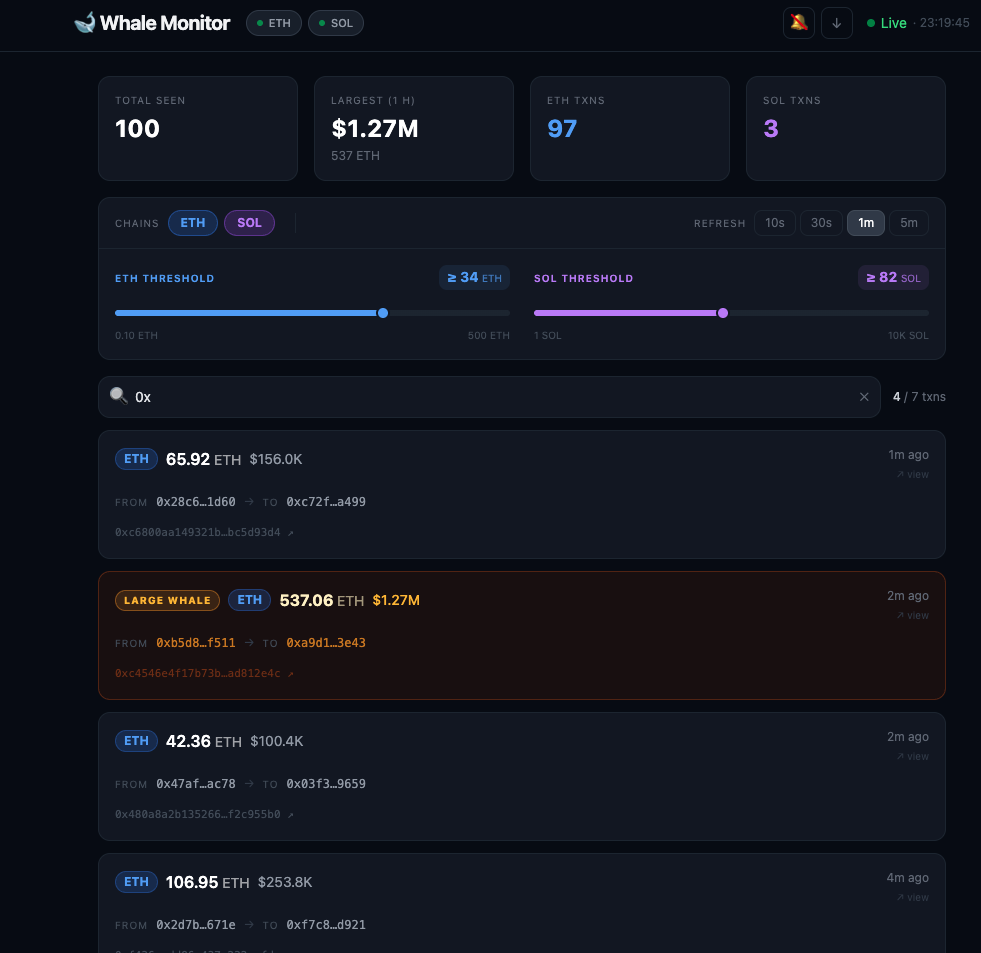

# 🐋 Crypto Whale Monitor

**Live demo:** https://crypto-whale-monitor.onrender.com

Real-time dashboard that surfaces large on-chain movements for **Ethereum** (≥ 100 ETH) and **Solana** (≥ 10 000 SOL).



---

## Stack

| Layer     | Tech                              |
|-----------|-----------------------------------|
| Backend   | FastAPI · Python 3.12 · httpx     |
| Data      | Etherscan API v2 · Solana public RPC |
| Prices    | Binance public ticker API            |
| Frontend  | React 18 · Vite · Tailwind CSS    |
| Infra     | Docker Compose                    |

---

## Quick start

### 1 — Copy env vars

```bash
cp .env.example .env
```

Edit `.env` and set your **Etherscan API key** (free at [etherscan.io/apis](https://etherscan.io/apis)).  
Solana uses the public RPC — no key needed.

```
ETHERSCAN_API_KEY=your_key_here
ETH_THRESHOLD=100          # min ETH per transfer
SOL_THRESHOLD=10000        # min SOL per transfer
POLL_INTERVAL_SECONDS=30   # backend poll cadence
ALLOWED_ORIGINS=http://localhost:3000  # comma-separated allowed CORS origins
```

### 2 — Build & run

```bash
docker compose up --build
```

| Service  | URL                        |
|----------|----------------------------|
| Frontend | http://localhost:3000      |
| API      | http://localhost:8000/docs |
| Health   | http://localhost:8000/health |

---

## Local development (without Docker)

**Backend**
```bash
cd backend
python -m venv .venv && source .venv/bin/activate
pip install -r requirements.txt
uvicorn main:app --reload
```

**Frontend** — update `vite.config.js` proxy target to `http://localhost:8000`
```bash
cd frontend
npm install
npm run dev
```

---

## API

```
GET /api/transactions
```

Returns the last 100 whale transactions as JSON:

```json
[
  {
    "chain":      "ETH",
    "hash":       "0xabc...",
    "amount":     150.0,
    "usd_value":  525000.0,
    "from_addr":  "0xdead...",
    "to_addr":    "0xbeef...",
    "timestamp":  1713200000
  }
]
```

---

## Architecture

```
docker-compose
 ├── api (FastAPI :8000)
 │    ├── eth.py  — polls Etherscan every 30 s, scans last 3 blocks
 │    ├── sol.py  — polls Solana RPC every 30 s, scans last 10 slots
 │    └── cache.py — in-memory deque, last 100 txns
 └── frontend (Vite :3000)
      ├── App.jsx      — polls /api/transactions every 30 s
      ├── StatsBar.jsx — totals + largest 1-h txn
      └── TxCard.jsx   — per-transaction card
```

---

## Screenshots



---

## Notes

- Etherscan free tier: 5 req/s — the poller stays well under with 250 ms inter-block delay.
- Solana public RPC has tight rate limits — 1 s delay between slot fetches.
- No database, no auth, no login — intentionally simple.
- USD prices fetched from Binance's public ticker API once per poll cycle.
- The API port (8000) is not published outside Docker — only the frontend (3000) is exposed.
